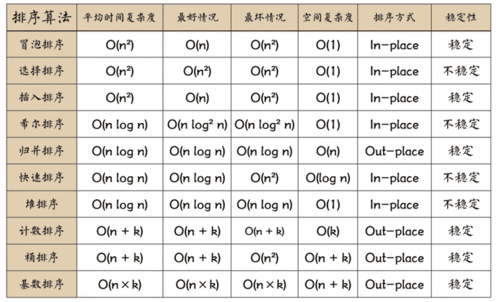
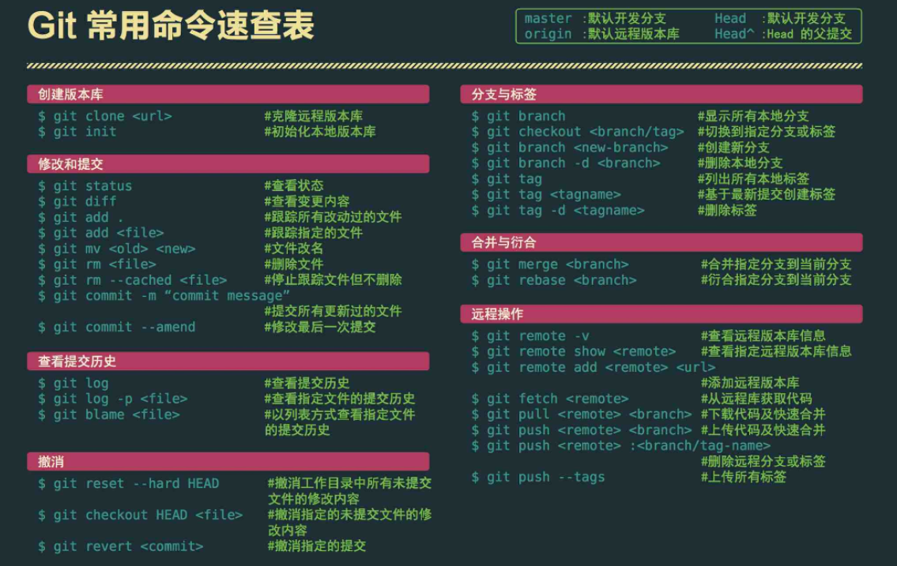

# 前端面试

## HTML CSS

## JavaScript

1. 回调函数
嵌套 函数体在完成某种操作后由内向外调用某个外部函数
函数作为参数传递给另外一个函数
回调地狱
回调函数是一个this对象的方法时，必须保证this对象的上下文，Call和Apply函数来保存this

### ES6

1. var let const
作用域. 变量提升. 重复声明. 暂时性死区
2. 数组新增
    1. ... 数组变成参数序列
    浅拷贝 解构赋值 参数最后一位 iterator对象转成数组
    2. 构造函数 Array.from() Array.of()
    3. 实例对象方法
    copyWithin() 复制覆盖
    find(). findIndex() 查找
    fill() 填充
    entries()，keys()，values() 遍历
    includes() 判断是否包含
    flat()，flatMap() 扁平化（层数）
3. 对象新增
    1. 简写
    2. 属性名表达式
    3. super指向当前对象的原型对象
    4. 扩展运算符 解构赋值 浅拷贝
    5. 属性遍历 数值键->字符串键->symbol键
    for...in：循环遍历对象自身的和继承的可枚举属性（不含 Symbol 属性）
    Object.keys(obj)：返回一个数组，包括对象自身的（不含继承的）所有可枚举属性（不含 Symbol 属性）的键名
    Object.getOwnPropertyNames(obj)：回一个数组，包含对象自身的所有属性（不含 Symbol 属性，但是包括不可枚举属性）的键名
    Object.getOwnPropertySymbols(obj)：返回一个数组，包含对象自身的所有 Symbol 属性的键名
    Reflect.ownKeys(obj)：返回一个数组，包含对象自身的（不含继承的）所有键名，不管键名是 Symbol 或字符串，也不管是否可枚举
    6. 方法
    Object.is() 严格相等 +0不等于-0，NaN等于自身
    Object.assign() 对象合并 浅拷贝替换
    Object.getOwnPropertyDescriptors()
    Object.setPrototypeOf()，Object.getPrototypeOf()
    Object.keys()，Object.values()，Object.entries()
    Object.fromEntries()
4. 函数新增
    1. 参数 尾参数
    2. length name
    3. 箭头函数 参数=>返回值
5. Set Map
    1. Set
    add() delete() has() clear()
    keys()：返回键名的遍历器
    values()：返回键值的遍历器
    entries()：返回键值对的遍历器
    forEach()：使用回调函数遍历每个成员
    数组字符串去重
    filter 并集交集差集
    2. Map
    set() get() has() delete() clear()
    keys()：返回键名的遍历器
    values()：返回键值的遍历器
    entries()：返回所有成员的遍历器
    forEach()：遍历 Map 的所有成员
    weak没有遍历属性
6. promise
 Promise(function(resolve, reject) {})
then()
catch()
finally()
Promise对象的错误具有“冒泡”性质，会一直向后传递，直到被捕获为止
7. generator
function关键字与函数名之间有一个星号
函数体内部使用yield表达式，定义不同的内部状态
通过next方法才会遍历，直到一个yield表达式暂停，返回值是yield表达式的值，下一次next方法继续，直到return
next可以带一个参数，当做一个yield表达式的返回值
返回的是Iterator对象，可以通过for...of进行遍历
8. 异步处理
回调函数
Promise 对象
generator 函数 可以控制迭代
async/await 本质上generator
9. proxy
用于创建一个对象的代理，从而实现基本操作的拦截和自定义
var proxy = new Proxy(target, handler)
Reflect 的所有属性和方法都是静态的（ Math 对象），提供拦截 JavaScript 操作的方法
get() set() deleteProperty()
Proxy.revocable(target, handler);取消代理
在复杂操作前对操作进行校验或对所需资源进行管理
拦截和监视外部对对象的访问
使用 Proxy 保障数据类型的准确性
使用Proxy实现观察者模式，观察者模式（Observer mode）指的是函数自动观察数据对象，一旦对象有变化，函数就会自动执行
10. module
静态化 在编译时就完成模块加载
export：用于规定模块的对外接口
import：用于输入其他模块提供的功能
11. decorator
装饰器命名相当于一个注释，在不改变原有代码情况下，对类和类属性原来功能进行扩充
不能修饰函数

## Vue.js

## Node.js

Node.js 是一个开源与跨平台的 JavaScript 运行时环境
事件驱动、非阻塞和异步输入输出模型

## 算法

1. 前端
diff算法 深度优先算法 时间复杂度:O(n) 最小量更新
patch 比较虚拟DOM根节点是否同一类型，不同直接替换
|
patchVnode 进一步比较两个虚拟节点 有无text和children
|
updateChildren 都有子节点的情况下比较更新真实节点
    四个指针，指向oldVnode子节点列表中的第一个节点和最后一个节点以及指向newVnode子节点列表中的第一个节点和最后一个节点，节点比较过，前的指针++，后的指针--
    1. oldS 和 newS 使用sameVnode方法进行比较，sameVnode(oldS, newS)
    2. oldS 和 newE 使用sameVnode方法进行比较，sameVnode(oldS, newE)，相同的话移动真实节点OE之后
    3. oldE 和 newS 使用sameVnode方法进行比较，sameVnode(oldE, newS)，相同的话移动真实节点OS之前
    4. oldE 和 newE 使用sameVnode方法进行比较，sameVnode(oldE, newE)
    5. 如果以上逻辑都匹配不到，再把所有旧子节点的 key 做一个映射到旧节点下标的 key -> index 表，然后用新 vnode 的 key 去找出在旧节点中可以复用的位置
    6. old先处理完，新增newS和newE之间的节点
    7. new先处理完，删除oldS和oldE之间的节点
key的设置 判断两个虚拟节点是否为相同节点
不建议用index作为循环项的key，因为操作过程中index会改变，一些相同节点index变了会被当成新的节点，用id的话每个节点key都不同，便于更新时复用节点
2. 排序

3. 数据结构
数组
栈
队列
链表
树
图
堆
散列表
4. 经典算法

## 网络协议

## Git

## echarts可视化
