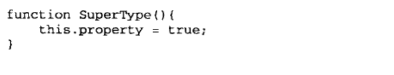
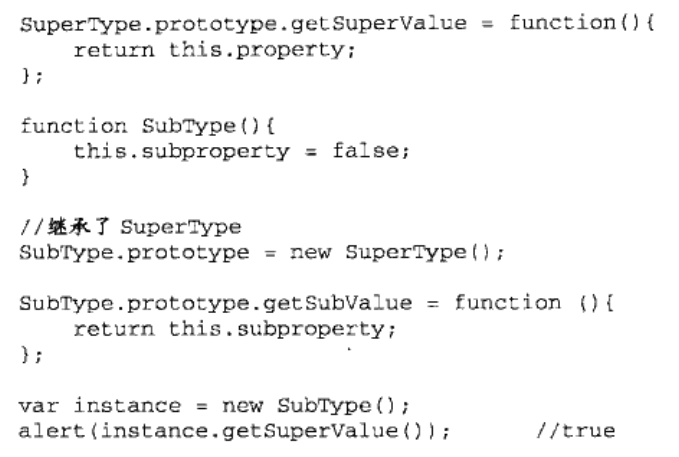
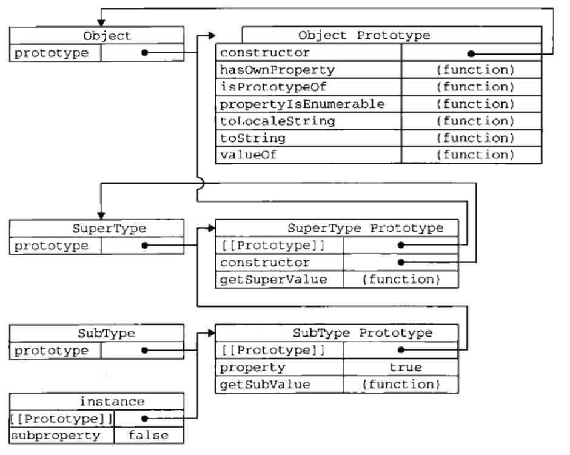
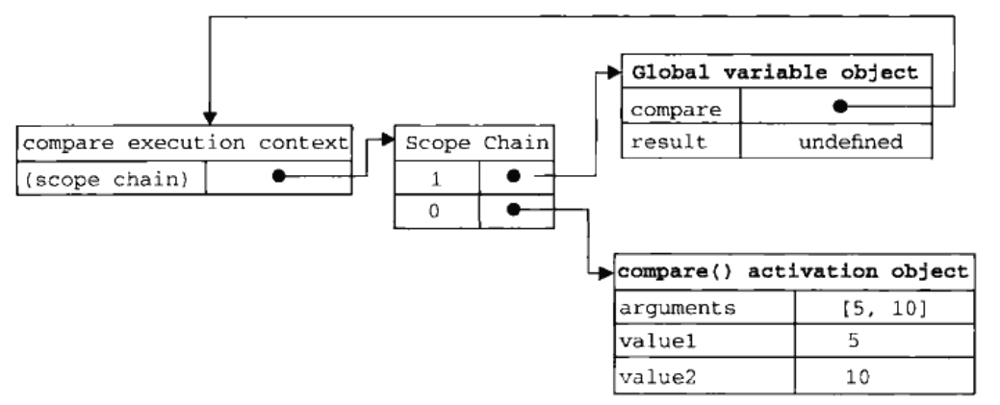
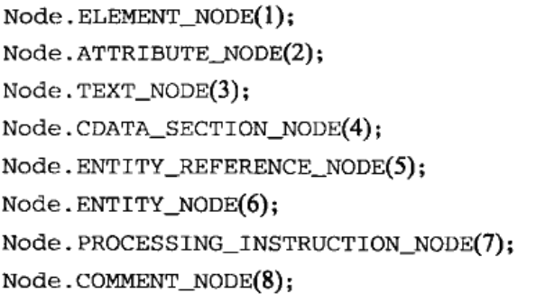
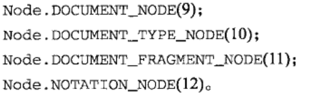

# JavaScript三部分

## 小问题

1. 继承
2. 闭包

**核心(ECMAScript)**  
语言的基本组成部分  
**文档对象模型(DOM)**  
把页面映射成多层节点结构 XML 扩展HTML  
提供访问和操作网页内容的方法和接口  
**浏览器对象模型(BOM)**  
与浏览器交互的方法和接口  

## < script>

async:下载脚本，外部脚本文件有效，不保证执行顺序  
charset:src属性指定的字符集  
defer:延迟到文档完全被解析后执行，外部脚本文件有效  
src:包含执行代码的外部文件  
type:脚本语言内容类型，默认值text/javascript  

放在HTML文件底部  
直接嵌入或包含外部文件  
直接嵌入要指定type属性
\ 一对出现，函数内部出现记得用转义符号<\/script>  
包含外部文件要指定src属性，\中不包含额外代码  
\  
放在\<body>元素中页面内容的后面  

## 基本概念(只记录了一些跟我印象中不同的点)

区分大小写
var创建变量是局部变量，省略后是全局变量
使用var和function声明的变量不可删除，因为被标记成不可配置了
delete不能删除全局变量，但是可以删除window对象上定义的属性
delete操作符跟直接释放内存无关，是断开引用间接完成的，对象的属性和数组成员才可以删除
这样的删除仍然占据内存空间，要设置null才能释放

1. 数据类型  

- Undefined
声明未初始化
typeof()
- Null
- Boolean
true false 字面值 全小写
其他类型的空值、0、NaN、null、undefined转换后都是false
- Number
NaN Number() parseInt() parseFloat()
- String
转义字符\
不可变
toString()
- object
new 跟Java蛮像的P35一些函数

typeof 返回数据类型 object null注意返回

2. 操作符（意外跟C很像）
一元操作符自增自减前置后置
位操作符
~非&与|或^异或>>右移<<左移 >>>无符号右移
==会强制转换 ===不会强制转换
?:
3. 语句
if do-while while for for-in
label标识特定位置 break continue with设置作用域
switch
4. 函数
function 参数不限制个数和类型 通过argument对象访问元素
参数传递都是值传递
没有重载，后面覆盖
5. 引用
instanceof
6. 作用域
没有块级作用域，if for语句中初始化变量在语句执行完之后依旧存在于语句外部执行环境
var是添加到最近的环境，没有就是添加到全局环境
7. 垃圾收集
标记清除

## 引用类型

- object类型
用new创建；对象字面量
很像字典，都是花括号里属性名：属性值
- Array类型
每一项可以保存任何类型的数据，动态调整数组大小
Array(数字)表示数组项目数量
Array(其他类型参数)创建包含那个值的只有一项的数组
方括号[]索引
isArray()
toString() 每个值的字符串形式，以逗号分隔
valueOf()
join()分隔符字符串
push() pop() stack
shift()移除第一个 unshift()前端添加 list
reverse()翻转
sort()比较字符串 小心15<5，从字符串上看，定义compare函数作为参数传入sort()
concat() 拼接字符串和多个数组的每一项
slice() 返回[开始索引，结束索引)中间的项，负数则用数组长度加上该数来确定位置
splice()
  - 删除 第一项位置，删除项数
  - 插入 起始位置，删除项数，插入的项
  - 替换 起始位置，删除项数，插入的项

  indexOf() lastIndexOf()查找位置，没找到返回-1
迭代方法
every() some() filter() forEach() map()
reduce() reduceRight()

- Date类型

- RegExp类型 每一次要创建新的实例
g全局i不分大小写m多行
exec()
- function类型
function 函数名(参数){语句;}
var 函数名=function(参数){语句;};
一个函数可以有多个名字
没有重载
arguments callee用于解除代码和函数名的耦合
this 先局部再全局
call() apply()
基本包装类型
Boolean Number String
不能添加属性和方法
charAt() charCodeAt() slice() substr() substring() indexOf() trim() toLowerCase() toUpperCase() match() search() replace() split() localeCompare() fromCharCode()

全局对象
URI编码方法
eval() 解析器 接受要执行的JS字符串
window对象
Math对象

## 面向对象

对象有属性和方法
使用Object.defineProperty()来修改属性特性

- 数据属性
  - Configurable
  能否修改或删除属性特性
  - Enumerable
  能否for-in循环
  - Writable
  能否修改属性值
  - Value
  读写值
- 访问器属性
  - Configurable
  能否修改或删除属性特性
  - Enumerable
  能否for-in循环
  - Get
  读取
  - Set
  写入
使用Object.defineProperties()定义多个属性

**工厂模式** 在函数里面新创建一个对象
**构造函数模式** 把函数当做构造函数，在外部直接new对象
**原型模式** 一个函数有prototype属性，其他实例共享prototype里面的属性和函数，先找对象实例本身属性，再找原型对象的属性，实例和原型之间的连接是指针
每个构造函数都有一个原型对象，原型对象都包含一个指向构造函数的指针，实例都包含一个指向原型对象的内部指针
hasOwnProperty()
in
constructor()
可以随时为原型添加属性和方法，但不要重写
**构造函数和原型模式的组合**
**动态原型模式** 在构造函数里初始化原型函数
**寄生构造函数** 要用new的工厂模式
**稳妥构造函数** 不能用this

实现继承 原型链

搜索属性会沿着原型链往上
通过原型链实现继承的时候，不能使用对象字面量创建原型方法，因为会重写原型链
在每一个创建的子类对象上使用超类对象的call或者apply方法进行所有对象初始化
寄生组合式继承是最完美的继承方式
不必为指定子类型的原型而调用超类型的构造函数

## 函数表达式

- 函数声明:function 函数名(){}
  函数声明可以置于调用语句之后
- 函数表达式:var 变量名=function(){};
  此为匿名函数
  要先赋值才可以调用
编写递归函数，函数内部用argument.callee代替函数名
函数第一次调用创建一个执行环境和作用域链，并把作用域连赋值给一个特殊的内部属性scope，然后初始化活动对象，外部，外部的外部，知道作用域链终点全局执行环境

闭包，在另一个函数内部定义的函数会将外部函数的活动对象添加到它的作用域
闭包结构：

- 一个函数，里面有一些变量和另一个函数
- 外部函数里面的函数使用了外部函数的变量
- 外部函数最后把它里面的那个函数用return抛出去

闭包作用：

- 在函数外部可以读取函数内部的变量
- 让这些变量的值始终保持在内存中

闭包只能取得包含函数中任何变量的最后一个值
解决方法是再嵌套一层函数，形成一个闭包
注意this的指向问题，可能闭包函数是在window作用域下执行的，this就不是指向外部函数而是window
内存泄漏问题，闭包引用外层对象，写一个变量保存对象副本，结束闭包后把对象置为null
多次声明同一变量，会对后续声明视而不见
在匿名函数中定义的任何变量都会在执行结束时被销毁
(function(){作用域})

## BOM

1. **window对象**
全局作用域中声明的变量和函数收拾window对象的属性和方法
尝试访问未声明的变量会抛出错误，但是可以查询window对象判断未声明的对象是否存在
**窗口关系和框架**
top对象指向最外层框架即浏览器窗口
parent对象指向当前框架的直接上层框架
没有框架的情况下parent=top=window
**窗口位置和大小**
moveTo(x,y)移动到实际位置
moveBy(x,y)移动量
resizeTo(x,y)设置大小
resizeBy(x,y)新的和原来的差
**导航和打开窗口**
window.open()
参数：URL，窗口目标，特性字符串，新页面是否取代浏览器中当前加载页的布尔值
window.setTimeout()执行代码和等待时间
clearTimeout()取消超时调用
setInterval()间隔时间重复执行
clearInterval()

2. **location对象**
既是window的属性也是document的属性
location.search访问URL里面的内容
location.assign()传递URL
location.reload()无参重载/有参服务器重载

3. **navigator**
plugins
registerContentHandler()

4. **screen对象**
5. **history对象**

## DOM

把HTML或者XML文档描绘成多层节点结构

1. **Node类型**

nodeType, nodeName, nodeValue, childNodes, NodeList, ownerDocument
appendChild(), insertBefore(),replaceChild(), cloneNode()(注意区别这里深复制是复制节点和子节点树，浅复制是只复制节点本身), normalize()
2. **Document类型**
window对象的一个属性，可以当做全局对象来访问
documentElement指向\<html\>
body指向\<body\>
title, URL, domain, referrer
getElementById()
getElementByTagName()返回的是同一个tag集合
HTMLCollection.namedItem()
HTMLCollection.getElementByNamed()
特殊集合P258
write(), writeln(), open(), close()
3. **Element**
attributes属性 get set remove

querySelector()接受CSS选择符

HTML5
getElementByClassName()
classList属性 add() contains() remove() toggle()
document.activeElement focus()
HTMLDocument属性
readyState
compatMode
head
charset
data-自定义数据属性
innerHTML
outerHTML
scrollIntoView()
简单描述一下就是一棵DOM树有节点和元素，还有自己对应的属性，可以创建节点然后添加到树里面，还可以直接设置元素的style属性
可以直接查询包含某些类或者ID的元素
遍历
NodeIterator
TreeWalker

## 事件

## ES6语法

1. 变量声明
let const var
可以创建块作用域
2. 剩余...
...参数 动态参数
...variable
...数组 拆解数组
3. apply(this,array) call(this,arg)
4. 解构赋值
左侧定义了要取出的值
剩余属性位于末尾结束解构模式
5. 箭头函数
去掉function，直接(参数)=>{}
不能用作方法
function定义的函数this随上下文变化而变化
箭头函数this始终指向定义函数的环境
6. promise
Promise 构造函数是 JavaScript 中用于创建 Promise 对象的内置构造函数，接受一个函数作为参数，该函数是同步的并且会被立即执行，所以我们称之为起始函数。起始函数包含两个参数 resolve 和 reject，起始函数执行成功时，它应该调用 resolve 函数并传递成功的结果。当起始函数执行失败时，它应该调用 reject 函数并传递失败的原因。
then：用于处理 Promise 成功状态的回调函数。
catch：用于处理 Promise 失败状态的回调函数。
finally：无论 Promise 是成功还是失败，都会执行的回调函数。
7. for in和 for of
数组遍历用for of，对象遍历用for in
for...in 语句以任意顺序迭代对象的可枚举属性。
for...of 语句遍历可迭代对象定义要迭代的数据。
