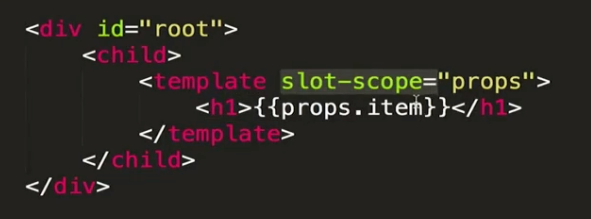

# vue

这份笔记主要记录的是vue2的语法

看了一下这个vue2全家桶列举挺完整全面的
<https://blog.csdn.net/qq_44663761/article/details/122328822?spm=1001.2101.3001.6650.16&utm_medium=distribute.pc_relevant.none-task-blog-2%7Edefault%7EOPENSEARCH%7ERate-16-122328822-blog-135767247.235%5Ev43%5Econtrol&depth_1-utm_source=distribute.pc_relevant.none-task-blog-2%7Edefault%7EOPENSEARCH%7ERate-16-122328822-blog-135767247.235%5Ev43%5Econtrol&utm_relevant_index=17>

vue3的补充更新语法<https://24kcs.github.io/vue3_study/chapter4/01_Composition%20API_%E5%B8%B8%E7%94%A8%E9%83%A8%E5%88%86.html>

vue3的关键在于理解Composition (组合) API和setup的使用

## vue基本语法

v-for绑定迭代
v-on绑定事件，简写形式"@"
v-model绑定数据

```vue
<div id="app">
    <input type="text" v-model="inputValue">
    <button v-on:click="handleBtnClick">提交</button>
    <ul>
        <li v-for="item in list">{{item}}</li>
    </ul>
</div>
var app=new Vue({
        el:'#app',
        data:{
            list:['first','second'],
            inputValue:''
        },
        methods:{
            handleBtnClick:function(){
                this.list.push(this.inputValue)
                this.inputValue=''
            }
        }
    })
```

v-bind绑定对象，简写形式":"
component全局组件

```vue
<todo-item v-bind:content="item" v-for="item in list"></todo-item>
Vue.component("TodoItem", {
    props: ["content"],
    template: "<li>{{content}}</li>",
  });
```

局部组件

```vue
var TodoItem = {
    props: ["content"],
    template: "<li>{{content}}</li>",
  };
  var app = new Vue({
    el: "#app",
    components: {
      TodoItem: TodoItem,
    },
    data: {
      list: ["first", "second"],
      inputValue: "",
    },
    methods: {
      handleBtnClick: function () {
        this.list.push(this.inputValue);
        this.inputValue = "";
      },
    },
  });
```

父子组件传值
父组件v-bind的格式向子组件传递，然后props里接收
子组件$emit向上一层触发事件，父组件监听获取

```vue
<todo-item
          v-bind:content="item"
          v-bind:index="index"
          v-for="(item, index) in list"
          @delete="handleItemDelete"
        >
        </todo-item>
var TodoItem = {
    props: ['content', 'index'],
    template: "<li @click='handleItemClick'>{{content}}</li>",
    methods: {
      handleItemClick: function () {
        this.$emit("delete", this.index);
      },
    },
  };
  var app = new Vue({
    el: "#app",
    components: {
      TodoItem: TodoItem,
    },
    data: {
      list: [],
      inputValue: "",
    },
    methods: {
      handleBtnClick: function () {
        this.list.push(this.inputValue);
        this.inputValue = "";
      },
      handleItemDelete: function (index) {
        this.list.splice(index, 1);
      },
    },
  });      
```

生命周期函数是指vue实例在某一个时间点会自动执行的函数  

图里是vue2的，vue3在命名上多了on和setup  
2.x 版本生命周期相对应的组合式 API  
beforeCreate -> 使用 setup()  
created -> 使用 setup()  
beforeMount -> onBeforeMount  
mounted -> onMounted  
beforeUpdate -> onBeforeUpdate  
updated -> onUpdated  
beforeDestroy -> onBeforeUnmount  
destroyed -> onUnmounted  
errorCaptured -> onErrorCaptured  

template
插值表达式{{}}

```vue
<div v-text="name+' abc'"></div> 输出字符串
<div v-html="name+' abc'"></div> 输出解析成html格式的字符串
<div>{{name+' abc'}}</div> 输出字符串
var app = new Vue({
    el: "#app",
    data: {
      name: "<h1>ella</h1>",
    },
    
  });
```

computed属性会有缓存，methods没有缓存性能较差
watch监听变化也有缓存

```vue
<div>
    {{fullName}}
    {{age}}
</div>
 var app = new Vue({
    el: "#app",
    data: {
      firstName:"Ella",
      lastName:"L",
      age:20
    },
    computed:{
        fullName:function(){
            return this.firstName+" "+this.lastName
        }
    },
    watch:{
        firstName:function(){
            this.fullName=this.firstName+" "+this.lastName
        },
        lastName:function(){
            this.fullName=this.firstName+" "+this.lastName
        },
        
    },
  });
```

set和get设置方法

```vue
computed: {
      fullName: {
        get: function () {
          return this.firstName + " " + this.lastName;
        },
        set:function(value){
            var arr=value.split(" ");
            this.firstName=arr[0];
            this.lastName=arr[1];
        }
      },
    },
```

样式绑定.通过v-band绑定class或者style来实现
可以绑定对象也可以是数组

```vue
<style>
    .activated{
        color: aquamarine;
    }
</style>
<div @click="handleDivClick" 
    :class="{activated:isActivated}"
    或者"[activated]"
>Ella
</div>
methods: {
    handleDivClick:function(){
    this.isActivated=!this.isActivated;
    或者this.activated=this.activated==="activated"?"":"activated";
    }
},
再或者<div :style="styleObj">hello world</div>
绑定style直接设置
```

条件渲染
v-if 对应的值为false直接在dom上不存在
v-show 对应的值为false，dom上存在，不显示
v-if可以写循环，必须连在一起

```vue
<div v-if="show==='a'">A</div>
<div v-else-if="show ==='b'">B</div>
<div v-else>C</div>
```

key值唯一可以保证不被复用
在控制台直接用下标[]修改数组内容是不会改变页面显示
要使用相应的修改函数才可以
push pop shift unshift splice sort reverse
或者直接改变数组引用对象也可以
对象也可以循环，用set方法修改内容
Vue.set(app.list,"number",18)
app.$set(app.list,"number",18)
Vue.set(target, key, val)

```vue
<div v-for="(item, index) of list"
           :key="item.id">
           {{item.text}}---{{index}}
      </div> 数组
<div v-for="(item, key) of list">
           {{item}}--{{key}}
      </div> 对象
```

\<table\>里面有\<tbody\>里面有\<tr\>里面有\<td\>
\<tbody\>里面不能直接用template，但是可以用is语句来指向template子组件

ul,ol,select标签同理
子组件里data必须是函数，不能是父组件中的对象，因为子组件都拥有独立数据不共享


用ref来操作dom

```vue
<div  ref="hello" 
            @click="handleClick" >hello world</div>
methods: {
      handleClick: function(){
        console.log(this.$refs.hello)；
        console.log(this.$refs.hello.innerHTML)
      }
    },
```


父子组件传递
父组件向子组件传数据，要在父组件components里先注册，然后标签里传参，子组件用props接收属性数据，且最好不要修改，克隆一个副本修改
子组件向父组件传值调用$emit(方法名)，父组件在标签里用@监听方法然后触发事件
子组件的

```vue
<div id="app">
      <counter :count="0" @change="handelIncrease"></counter>注意在这里定义的事件是和父组件绑定的，要子组件$emit
      <counter :count="1" @change="handelIncrease"></counter>
      <div>{{total}}</div>
    </div>
var counter = {
    props: ["count"],
    data: function () {
      return {
        number: this.count,
      };
    },
    template: "<div @click='handleClick'>{{number}}</div>",这里定义的事件才是子组件自定义事件，和子组件里面的method绑定
    methods: {
      handleClick: function () {
        this.number++;
        this.$emit("change", 1);
      },
    },
  };
  var vm = new Vue({
    el: "#app",
    data: {
      total: 1,
    },
    components: {
      counter: counter,
    },
    methods: {
      handelIncrease: function (step) {
        this.total += step;
      },
    },
  });
```

传参校验

非props特性会显示在dom标签里，父组件传子组件不接收
绑定原生事件只需要在事件后加上.native
非父子组件传值bus 发布订阅模式 观察者模式

```vue
<div id="app">
      <child content="ella" ></child>
      <child content="syray"></child>
    </div>
Vue.prototype.bus = new Vue();
  Vue.component("child", {
    data:function(){
        return{
            selfContent:this.content
        }
    },
    props: {
      content: String,
    },
    template: "<div @click='handleClick'>{{selfContent}}</div>",
    methods:{
        handleClick:function(){
            this.bus.$emit('change',this.selfContent)
        }
    },
    mounted:function(){
        var this_=this;
        this.bus.$on('change',function(msg){
            this_.selfContent=msg;
        })
    }
  });
  var vm = new Vue({
    el: "#app",
  });
```

插槽

```vue
<div id="app">
      <child>
        <p slot="head">ella1</p>
        <p slot="foot">ella2</p>
      </child>
    </div>
 template: `<div>
                    <p>hello</p>
                    <slot name='head'>default</slot>
                    <slot name='foot'>default</slot>
               </div>`,
```




动态组件
v-once是创建一次就放入内存中，提高性能，不会反复创建

```vue
<div id="app">
      <component :is="type"></component>
      <button @click="handleBtnClick">change</button>
    </div>
  Vue.component('child-one',{
    template:'<div v-once>one</div>'
  })
  Vue.component('child-two',{
    template:'<div v-once>two</div>'
  })
  
  var vm = new Vue({
    el: "#app",
    data:{
        type:'child-one'
    },
    methods:{
        handleBtnClick:function(){
            this.type=this.type==='child-one'?'child-two':'child-one';
        }
    }
  });
```

CSS动画效果是通过在某一时间上自动往标签上增加一些样式实现的

```vue
//过渡效果
<style>
        .v-enter,
        .v-leave-to{
            opacity: 0;
        }
        .v-enter-active,
        .v-leave-active{
            transition:opacity 3s;
        }
</style>
//弹跳效果
<style>
        @keyframes bounce-in {
            0%{
                transform:scale(0);
            }
            50%{
                transform:scale(1.5);
            }
            100%{
                transform:scale(1);
            }
        }
        .v-enter-active{
            transform-origin: left center;
            animation: bounce-in 1s;
        }
        .v-leave-active{
            transform-origin: left center;
            animation: bounce-in 1s reverse;
        }
</style>
<transition>
    <h1 v-if="show">ella</h1>
</transition>
    <button @click="handleBtnClick">change</button>

//配合使用css动画库
<link
    rel="stylesheet"
    href="https://cdnjs.cloudflare.com/ajax/libs/animate.css/4.1.1/animate.min.css"
    />
    <style>
        .v-enter,
        .v-leave-to{
            opacity: 0;
        }
        .v-enter-active,
        .v-leave-active{
            transition:opacity 3s;
        }
    </style>

<div id="app">
        <transition 
        type="transition"
        //这里可以自定义入场和出场动画时长
        :duration="{enter:5000,leave:10000}"
        appear
        enter-active-class="animate__animated animate__swing v-enter-active"
        leave-active-class="animate__animated animate__flip v-leave-active"
        appear-active-class="animate__animated animate__flash">
            <h1 v-if="show">ella</h1>
        </transition>
        <button @click="handleBtnClick">change</button>
    </div>

//jS动画
<div id="app">
        <transition 
            @before-enter="handleBeforeEnter"
            @enter="handleEnter"
            @after-enter="handleAfterEnter">
            <h1 v-if="show">ella</h1>
        </transition>
        <button @click="handleBtnClick">change</button>
    </div>
 var vm = new Vue({
    el: "#app",
    data:{
        show:true
    },
    methods:{
        handleBtnClick:function(){
            this.show=!this.show;
        },
        handleBeforeEnter:function(el){
            el.style.color='red'
        },
        handleEnter:function(el,done){
            setTimeout(()=>{
                el.style.color='green'
            },2000)
            setTimeout(()=>{
                done()
            },4000)
        },
        handleAfterEnter:function(el){
            el.style.color='blue';
        }
    }
  });
//velocity库
handleEnter:function(el,done){
            Velocity(el,{opacity:1},{duration:1000,complete:done})
        },
```


动画封装


## Vue3

1. 指令语法

2. 数组
变更方法
push()
pop()
shift()
unshift()
splice()
sort()
reverse()
非变更方法
filter(), concat(), slice()
reverse()和sort()调用之前创建一个原数组的副本
3. 事件处理
内敛事件 方法事件
4. 生命周期
不要用箭头函数，否则无法用this访问组件实例
5. watch侦听器
6. 路由
动态路由匹配 :传递
routes:{}里面的的路由地址可以有相对路径，可以嵌套子路径
\<router-link to=""></router-link\>里面必须是绝对路径
$router.push("")JS实现页面跳转 ?传递
使用命名路由跳转的时候注意要用v-bind:to="{name:'',params:{}}"
7. 组件
注意data是一个函数要返回return，组件之间不共享

## 问题

axios发送post请求会405

bind()方法主要是可以改变原本函数的this指向

ref用法
this.$ref.取到的是dom元素/组件实例

## 开发注意小知识点

1. \<router-link>传参是v-bind:to
:to="{path:'/root',query:{id:value}}"
2. v-bind:class
以键值对的形式绑定操作
3. import
<https://blog.csdn.net/qq_40323256/article/details/101867706>
注意export导出的引入要{}，export default不需要

## 前后端分离问题汇总

完整逻辑
<https://blog.csdn.net/qq_42345108/article/details/108249173>

1. element UI表单 验证
<https://blog.csdn.net/qq_41008567/article/details/115939951>
2. axios
<https://www.axios-http.cn/docs/intro>
请求/响应前进行拦截
拦截器
逻辑顺序
    1. 在vue.config.js里定义devServer的代理服务器和api前缀指向
    
    2. 然后定义utils文件夹里的request.js，在该文件里引入axios，创建axios对象和要访问的URL即前面定义的API前缀，然后定义请求和响应拦截器，最后export定义的request对象
    
    3. 在apis文件夹里引入定义好的request对象，开始编写具体的request函数，包括后台接口的url，http协议方法，传递的参数
    
    4. 在vue视图里引入apis里的request函数并调用，注意调用后的返回值
这里同样可以直接在vue组件里面使用类似下方结构来调用

```vue
axios.post("/users/payMent",{
                addressId:addressId,
                orderTotal:this.orderTotal
              }).then((response)=>{
                  let res = response.data;
                  if(res.status=="0"){
                      this.$router.push({
                          path:'/orderSuccess?orderId='+res.result.orderId
                      })
                  }
              })
```

get请求参数不同
post
<https://zhuanlan.zhihu.com/p/275695831>

3. vuex
状态管理模式
解构简写

```vue
import { mapState } from 'vuex'
computed:{
  ...mapState(['nickName','cartCount'])
},
```

- state
唯一数据源，单一状态树
computed里面定义
this.$store.state.
- getter
可以派生出一些新的状态
可以直接在state数据上包装而不用重新定义数据，类似数据库里视图的概念
this.$store.state.getters
- mutation
更改state的唯一方法是提交mutation
this.$store.commit()
- action
提交的是mutation，而不是直接变更状态
可以异步操作
调用this.$store.dispatch("f")
定义f(a){a.commit()}
- module
将多个store对象分割成模块

4. this
this对象问题
<https://juejin.cn/post/7109889547537743886>
this.$
<https://segmentfault.com/a/1190000040894587>

5. vue插件
extend和component类似
<https://juejin.cn/post/7239715295484821565>

6. webpack
<https://cloud.tencent.com/developer/article/1797938>

7. 跨域问题

## echarts实战

### vue3部分很多问题

1. 恨，vscode插件加载不全，重载几遍就好了
2. ./APP.vue找不到
<https://blog.csdn.net/XSL_HR/article/details/128437240>
3. router-view不渲染
由于没有后端支持，创建路由的history部分要用hash
<https://blog.csdn.net/weixin_43575792/article/details/122655356>
4. 基本都是围绕setup里面响应式数据声明出的问题  
ref和reactive  
5. vuex和vue-router部分有了更新
